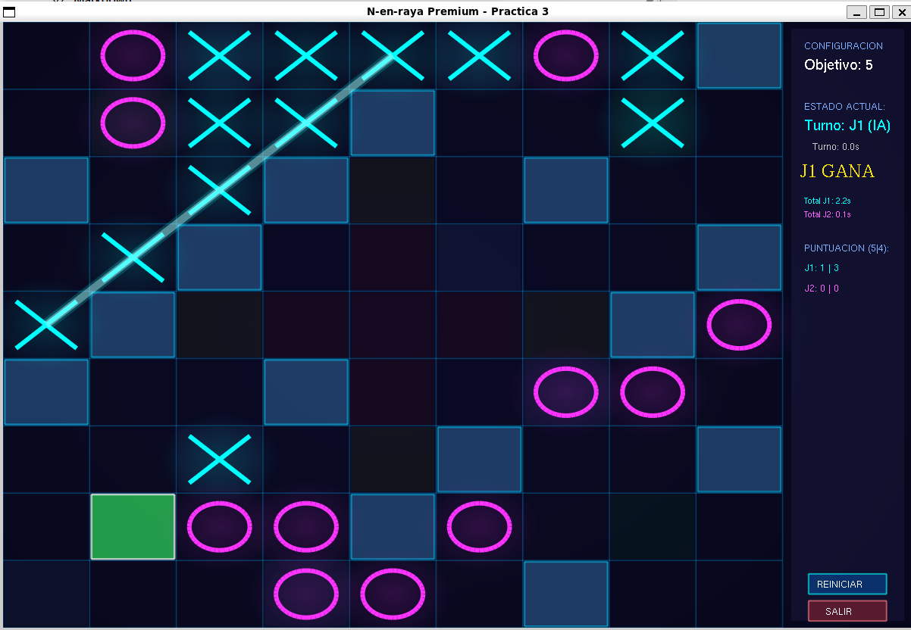

# Tactical Five-in-a-Row

**Development period:** May – June 2026  
**Course:** Artificial Intelligence  
**University:** University of Granada  
**Language:** C++

Adversarial-search Artificial Intelligence project developed in C++ for a tactical variant of Five-in-a-Row played on a 9×9 board.

## Gameplay



The project focuses on the design of an intelligent game-playing agent capable of analysing possible future states, evaluating board positions and selecting competitive moves against different opponents.

## Overview

Tactical Five-in-a-Row extends the traditional alignment game with a larger search space and additional strategic rules.

The objective is to align five pieces horizontally, vertically or diagonally while dealing with special board mechanics and asymmetric turns.

The intelligent agent uses adversarial search techniques to choose its moves by exploring possible future game states and evaluating the consequences of both its own actions and the opponent's responses.

## Artificial Intelligence techniques

### Minimax

The Minimax algorithm explores the game tree assuming that both players make optimal decisions.

The agent evaluates possible future board states and selects the move that maximises its expected result while considering the opponent's best possible response.

### Alpha-Beta pruning

Alpha-Beta pruning is used to improve the efficiency of Minimax by avoiding branches of the game tree that cannot affect the final decision.

This reduces the number of states that need to be evaluated and allows the agent to explore deeper positions more efficiently.

### Heuristic evaluation

Because exhaustively exploring the complete game tree of a 9×9 board is computationally impractical, the agent uses heuristic evaluation functions to estimate the quality of non-terminal board states.

These heuristics guide the search towards strategically advantageous positions and are used to improve the agent's performance against competitive opponents.

### Status search

A complete search mode is also implemented for smaller game configurations.

This search determines the theoretical result of a position assuming optimal play:

- Victory
- Draw
- Defeat

## Competition mode

The competition version uses a **9×9 board** with the objective of connecting **five pieces**.

It introduces additional rules that significantly increase the complexity of the search space:

- Asymmetric turn sequence
- Placement restrictions based on board phases
- Mandatory adjacency to existing pieces
- Special board cells with different effects
- Additional strategic constraints when selecting valid moves

These mechanics require the agent to consider not only alignment opportunities, but also the consequences of special cells and future opponent responses.

## My contribution

The game simulator and supporting infrastructure were provided as part of the course.

My implementation is contained in `Comportamiento_Agente/` and includes:

- Status search
- Minimax
- Alpha-Beta pruning
- Heuristic evaluation functions
- Intelligent move selection
- Adversarial decision-making
- Evaluation of future board states

## Project structure

```text
tactical-five-in-a-row/
├── Comportamiento_Agente/
│   ├── AgenteEstudiante.cpp
│   └── AgenteEstudiante.hpp
├── include/
├── src/
├── images/
│   └── gameplay.png
├── CMakeLists.txt
├── install.sh
├── ninja_bridge.py
├── .gitignore
└── README.md
```

The main Artificial Intelligence implementation developed for the assignment is located in `Comportamiento_Agente/`.

The remaining files provide the game simulator and supporting infrastructure required to compile and run the project.

### `AgenteEstudiante.cpp`

Contains the main Artificial Intelligence logic developed for the project, including:

- Status search
- Minimax
- Alpha-Beta pruning
- Heuristic board evaluation
- Search-tree exploration
- Intelligent move selection

### `AgenteEstudiante.hpp`

Contains the declarations and structures required by the intelligent agent.

## Technologies

- C++
- STL
- Adversarial search
- Minimax
- Alpha-Beta pruning
- Heuristic evaluation
- Game-tree search
- CMake
- Git
- GitHub

## Academic context

Developed for the **Artificial Intelligence** course during the **2025/2026 academic year** at the **University of Granada**.

The project was developed using a game simulator provided as part of the course. The implementation developed for the assignment is primarily contained in `Comportamiento_Agente/`.

## Author

**Laura Padilla**  
Computer Engineering & Business Administration student  
University of Granada
